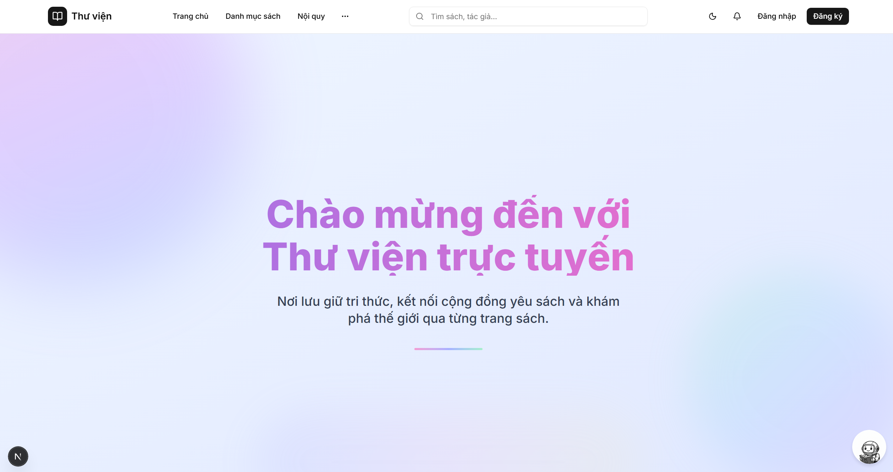
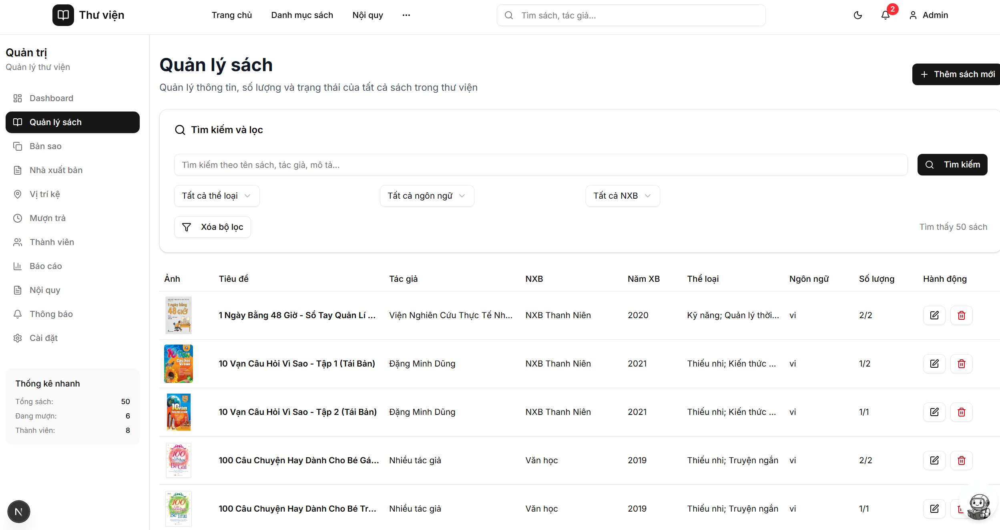
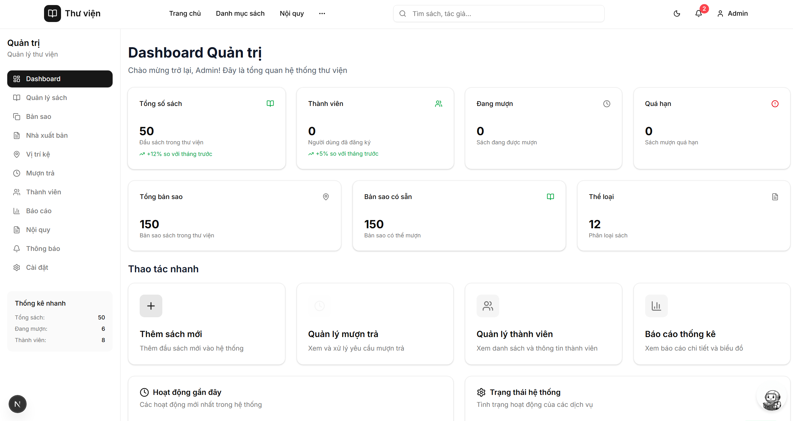

<div align="center">

# Hệ thống Quản lý Thư viện

**Phát triển phần mềm quản lý thư viện trên nền Web**

[](https://fastapi.tiangolo.com/)
[](https://nextjs.org/)
[](https://react.dev/)
[](https://www.mysql.com/)
[](https://www.python.org/)
[](https://www.typescriptlang.org/)

[](LICENSE)
[]()

</div>

---

## 📑 Mục lục

- [Giới thiệu](#-giới-thiệu)
- [Tính năng chính](#-tính-năng-chính)
- [Công nghệ sử dụng](#️-công-nghệ-sử-dụng)
- [Cài đặt & Chạy](#-cài-đặt--chạy)
- [Cấu trúc dự án](#-cấu-trúc-dự-án)
- [API Endpoints](#-api-endpoints)
- [Environment Variables](#-environment-variables)
- [Development Workflow](#-development-workflow)
- [Troubleshooting](#-troubleshooting)
- [Deployment](#-deployment)
- [Tài liệu](#-tài-liệu)
- [Nhóm phát triển](#-nhóm-phát-triển)

---

## 📖 Giới thiệu

**Hệ thống Quản lý Thư viện** là một ứng dụng web full-stack hiện đại được phát triển để tự động hóa và quản lý toàn bộ hoạt động của thư viện. Hệ thống được xây dựng với kiến trúc hiện đại, giao diện thân thiện và đầy đủ các tính năng cần thiết cho việc quản lý thư viện từ quy mô nhỏ đến trung bình.

### 🎯 Mục tiêu

- ✅ **Tự động hóa** quy trình mượn trả sách
- ✅ **Quản lý kho sách** hiệu quả với hệ thống bản sao và vị trí
- ✅ **Cung cấp thông tin** minh bạch cho người dùng
- ✅ **Tự động tính phạt** khi trả sách trễ
- ✅ **Báo cáo thống kê** tự động và trực quan
- ✅ **Hệ thống thông báo** real-time
- ✅ **Tích hợp Chatbot** hỗ trợ tìm kiếm sách

---

## ✨ Tính năng chính

### 👥 Quản lý Người dùng
- 🔐 Đăng ký, đăng nhập với JWT authentication
- 👤 Quản lý hồ sơ cá nhân
- 🎭 Phân quyền Admin/User
- 📋 Phân loại người dùng: Student, Staff, Guest

### 📚 Quản lý Sách & Bản sao
- 📖 CRUD sách với đầy đủ thông tin (tiêu đề, tác giả, NXB, thể loại, mô tả)
- 🖼️ Quản lý ảnh sách (nhiều ảnh, ảnh đại diện)
- 📑 Quản lý bản sao với mã định danh riêng
- 📍 Quản lý vị trí kệ sách (tầng, phòng, kệ, hàng, cột)
- 🔍 Tìm kiếm và lọc sách theo nhiều tiêu chí

### 📋 Quản lý Mượn Trả
- 📥 Yêu cầu mượn sách trực tuyến
- ✅ Duyệt/từ chối yêu cầu mượn
- 📤 Yêu cầu trả sách
- 💰 Tự động tính phạt khi trả trễ
- 📊 Quản lý trạng thái phiếu mượn (requested, borrowed, returned, overdue)
- ⚙️ Chính sách mượn linh hoạt theo loại người dùng

### 🔔 Hệ thống Thông báo
- 📢 Thông báo real-time cho người dùng
- 📨 Gửi thông báo đơn lẻ hoặc hàng loạt
- 🔴 Đếm số thông báo chưa đọc
- 📬 Thông báo hệ thống tự động

### 📊 Báo cáo & Thống kê
- 📈 Dashboard tổng quan với biểu đồ trực quan
- 📚 Top sách được mượn nhiều nhất
- 👥 Top người dùng tích cực
- ⚠️ Top sách quá hạn
- 💵 Thống kê tiền phạt
- 📅 Thống kê mượn/trả theo tháng
- 📥 Export dữ liệu Excel

### ⚙️ Cài đặt & Quy định
- 🎯 Quản lý chính sách mượn theo loại người dùng
- 📜 Quản lý nội quy thư viện (tĩnh và động)
- 🏢 Cấu hình thông tin thư viện
- 🏦 Thông tin ngân hàng, giờ mở cửa

### 🤖 Chatbot AI
- 💬 Tương tác chatbot để tìm kiếm sách
- 🔍 Tra cứu sách theo nhu cầu
- 📍 Xem vị trí sách trên kệ
- 📦 Kiểm tra tồn kho
- ❓ Hỏi quy định mượn/gia hạn/phạt

---

## 🛠️ Công nghệ sử dụng

### Backend
| Công nghệ | Phiên bản | Mô tả |
|-----------|-----------|-------|
| **FastAPI** | 0.111.0 | Framework Python hiện đại, hiệu năng cao |
| **Uvicorn** | 0.30.1 | ASGI server cho FastAPI |
| **SQLAlchemy** | 2.0.30 | ORM cho Python |
| **PyMySQL** | 1.1.1 | MySQL driver |
| **Pydantic** | 2.7.1 | Data validation |
| **Passlib** | 1.7.4 | Password hashing (bcrypt) |
| **Python-jose** | 3.3.0 | JWT token handling |
| **Alembic** | 1.13.2 | Database migrations |

### Frontend
| Công nghệ | Phiên bản | Mô tả |
|-----------|-----------|-------|
| **Next.js** | 15.4.6 | React framework với SSR |
| **React** | 19.1.0 | UI library |
| **TypeScript** | 5.0 | Type-safe JavaScript |
| **Tailwind CSS** | 4.0 | Utility-first CSS |
| **shadcn/ui** | Latest | Component library |
| **Radix UI** | Latest | Accessible UI primitives |
| **Chart.js** | 4.5.0 | Chart visualization |
| **Recharts** | 3.1.2 | React chart library |
| **Framer Motion** | 12.23.12 | Animation library |

### Database
| Công nghệ | Phiên bản | Mô tả |
|-----------|-----------|-------|
| **MySQL** | 8.x | Relational database |
| **Charset** | utf8mb4 | Full Unicode support |

---

## 🚀 Cài đặt & Chạy

### Yêu cầu hệ thống

- **Python** 3.8+
- **Node.js** 18+
- **MySQL** 8.x
- **Git**

### Cài đặt nhanh (Windows)

1. **Clone repository**
   ```bash
   git clone <repository-url>
   cd library-system
   ```

2. **Chạy script tự động**
   ```bash
   start-dev.bat
   ```
   
   Script sẽ tự động:
   - ✅ Tạo virtual environment
   - ✅ Cài đặt dependencies backend
   - ✅ Cài đặt dependencies frontend
   - ✅ Khởi động Backend API (port 8000)
   - ✅ Khởi động Frontend (port 3000)

### Cài đặt thủ công

#### 1. Database Setup

```bash
# Tạo database
mysql -u root -p
CREATE DATABASE librarydb CHARACTER SET utf8mb4 COLLATE utf8mb4_unicode_ci;

# Import schema
mysql -u root -p librarydb < docs/schema.sql
```

#### 2. Backend Setup

```bash
cd backend

# Tạo virtual environment
python -m venv .venv

# Activate (Windows)
.venv\Scripts\activate

# Activate (Linux/Mac)
source .venv/bin/activate

# Cài đặt dependencies
pip install -r requirements.txt

# Tạo file .env trong backend/
# Tạo file .env với nội dung:
cat > .env << EOF
# Database
MYSQL_USER=root
MYSQL_PASSWORD=
MYSQL_HOST=127.0.0.1
MYSQL_PORT=3306
MYSQL_DB=librarydb

# JWT
JWT_SECRET_KEY=your-secret-key-change-this
JWT_ALGORITHM=HS256
ACCESS_TOKEN_EXPIRES_MINUTES=60

# App
APP_NAME=Library Management System
DEBUG=True
EOF

# Chạy server
python -m uvicorn app.main:app --reload --host 0.0.0.0 --port 8000
```

#### 3. Frontend Setup

```bash
cd frontend

# Cài đặt dependencies
npm install

# Tạo file .env.local
cp env.example .env.local

# Hoặc tạo thủ công với nội dung:
# NEXT_PUBLIC_API_URL=http://localhost:8000

# Chạy development server
npm run dev
```

### Truy cập ứng dụng

- **Frontend**: http://localhost:3000
- **Backend API**: http://localhost:8000
- **API Documentation**: http://localhost:8000/docs
- **Admin Account**: 
  - Email: `admin@gmail.com`
  - Password: `123456`

---

## 📁 Cấu trúc dự án

```
library-system/
├── backend/                 # Backend API (FastAPI)
│   ├── app/
│   │   ├── main.py         # FastAPI application entry
│   │   ├── config.py       # Configuration settings
│   │   ├── db.py           # Database connection
│   │   ├── models/         # SQLAlchemy models
│   │   ├── routers/        # API routes
│   │   ├── schemas/        # Pydantic schemas
│   │   └── security/       # Authentication & authorization
│   └── requirements.txt    # Python dependencies
│
├── frontend/                # Frontend (Next.js)
│   ├── app/                # Next.js App Router pages
│   ├── components/         # React components
│   ├── contexts/           # React contexts
│   ├── lib/                # Utilities & API client
│   └── package.json        # Node dependencies
│
├── docs/                    # Documentation
│   ├── diagrams/           # UML diagrams (Draw.io, PlantUML)
│   ├── schema.sql          # Database schema
│   └── TAI_LIEU_HOAN_CHINH.md  # Complete documentation
│
├── start-dev.bat           # Auto-start script (Windows)
└── README.md               # This file
```

---

## 🔌 API Endpoints

### Authentication
- `POST /api/auth/register` - Đăng ký tài khoản
- `POST /api/auth/login` - Đăng nhập
- `GET /api/auth/me` - Lấy thông tin user hiện tại
- `POST /api/auth/refresh` - Refresh token

### Books
- `GET /api/books` - Danh sách sách (search, filter, pagination)
- `GET /api/books/{id}` - Chi tiết sách
- `POST /api/books` - Tạo sách mới (Admin)
- `PUT /api/books/{id}` - Cập nhật sách (Admin)
- `DELETE /api/books/{id}` - Xóa sách (Admin)

### Loans
- `POST /api/loans/request` - Yêu cầu mượn sách
- `POST /api/loans/{id}/return-request` - Yêu cầu trả sách
- `GET /api/loans/my-loans` - Danh sách phiếu mượn của user
- `GET /api/loans` - Danh sách tất cả phiếu mượn (Admin)
- `POST /api/loans/{id}/approve` - Duyệt mượn (Admin)
- `POST /api/loans/{id}/reject` - Từ chối mượn (Admin)
- `POST /api/loans/{id}/approve-return` - Duyệt trả (Admin)

### Reports
- `GET /api/reports/overview` - Tổng quan thống kê
- `GET /api/reports/top-books` - Top sách mượn nhiều
- `GET /api/reports/top-users` - Top người dùng
- `GET /api/reports/fines` - Thống kê tiền phạt

📖 **Xem đầy đủ API documentation tại**: http://localhost:8000/docs

---

## 🎨 Tính năng nổi bật

### 🎯 Giao diện hiện đại
- ✨ UI/UX thân thiện với shadcn/ui
- 📱 Responsive design cho mọi thiết bị
- 🎨 Dark mode support (coming soon)
- ⚡ Fast loading với Next.js SSR

### 🔒 Bảo mật
- 🔐 JWT authentication với refresh tokens
- 🔑 Password hashing với bcrypt
- 🛡️ Input validation với Pydantic
- 🚫 SQL injection protection
- 👮 Role-based access control

### 📊 Báo cáo trực quan
- 📈 Biểu đồ Chart.js & Recharts
- 📥 Export Excel với xlsx
- 📅 Filter theo thời gian
- 📊 Real-time statistics

---

## 🎨 Screenshots

> 📸 _Screenshots sẽ được cập nhật sau khi deploy_

| Trang chủ | Quản lý sách | Dashboard Admin |
|-----------|--------------|-----------------|
|  |  |  |

---

## 🔧 Environment Variables

### Backend (.env)
```env
# Database
MYSQL_USER=root
MYSQL_PASSWORD=your_password
MYSQL_HOST=127.0.0.1
MYSQL_PORT=3306
MYSQL_DB=librarydb

# JWT
JWT_SECRET_KEY=your-secret-key-change-in-production
JWT_ALGORITHM=HS256
ACCESS_TOKEN_EXPIRES_MINUTES=60

# App
APP_NAME=Library Management System
DEBUG=True

# Chatbot (Optional)
CHATBOT_PROVIDER=none  # none, ollama, gemini
OLLAMA_URL=http://localhost:11434
GEMINI_API_KEY=your-api-key
```

### Frontend (.env.local)
```env
NEXT_PUBLIC_API_URL=http://localhost:8000
NEXT_PUBLIC_APP_NAME="Thư viện trực tuyến"
```

---

## 📝 Development Workflow

### Backend Development
```bash
cd backend
.venv\Scripts\activate  # Windows
# source .venv/bin/activate  # Linux/Mac

# Run with auto-reload
python -m uvicorn app.main:app --reload --host 0.0.0.0 --port 8000

# Check API docs
# Visit http://localhost:8000/docs
```

### Frontend Development
```bash
cd frontend
npm run dev        # Development server
npm run build      # Production build
npm run start      # Start production server
npm run lint       # Run ESLint
```

### Database Migrations
```bash
# Schema is in docs/schema.sql
# Import directly:
mysql -u root -p librarydb < docs/schema.sql

# Or use MySQL Workbench to import the schema
```

### Common Commands

```bash
# Backend
pip install -r requirements.txt    # Install dependencies
python -m uvicorn app.main:app --reload  # Run server

# Frontend
npm install                        # Install dependencies
npm run dev                        # Development server
npm run build                      # Production build
npm run lint                       # Run linter
```

---

## 🧪 Testing

> ⚠️ Testing suite sẽ được thêm vào trong tương lai

- [ ] Unit tests (Backend)
- [ ] Integration tests (API)
- [ ] E2E tests (Frontend)
- [ ] Performance testing

---

## 🤝 Contributing

Contributions are welcome! Please feel free to submit a Pull Request.

1. Fork the project
2. Create your feature branch (`git checkout -b feature/AmazingFeature`)
3. Commit your changes (`git commit -m 'Add some AmazingFeature'`)
4. Push to the branch (`git push origin feature/AmazingFeature`)
5. Open a Pull Request

---

## 📚 Tài liệu

- 📖 [Tài liệu đầy đủ](library-system/docs/TAI_LIEU_HOAN_CHINH.md)
- 🗂️ [Database Schema](library-system/docs/schema.sql)
- 📊 [UML Diagrams](library-system/docs/diagrams/)
- 🔌 [API Documentation](http://localhost:8000/docs) (khi chạy server)

---

## 🐛 Troubleshooting

### Backend không khởi động
```bash
# Kiểm tra Python version
python --version  # Phải >= 3.8

# Kiểm tra virtual environment
.venv\Scripts\activate
pip list  # Kiểm tra packages đã cài

# Reinstall dependencies
pip install -r requirements.txt --force-reinstall
```

### Frontend không kết nối được API
```bash
# Kiểm tra .env.local
NEXT_PUBLIC_API_URL=http://localhost:8000

# Kiểm tra Backend đang chạy
curl http://localhost:8000/api/health

# Clear Next.js cache
rm -rf .next
npm run dev
```

### Database connection error
```bash
# Kiểm tra MySQL đang chạy
mysql -u root -p

# Kiểm tra database đã tạo
SHOW DATABASES;

# Kiểm tra .env trong backend
MYSQL_USER=root
MYSQL_PASSWORD=your_password
MYSQL_DB=librarydb
```

---

## 🐛 Known Issues & Roadmap

### Known Issues
- [ ] Chatbot integration cần cấu hình thêm
- [ ] Email notifications chưa được implement
- [ ] Mobile app chưa có

### Roadmap
- [ ] Thêm email notifications
- [ ] Cải thiện chatbot với AI/LLM
- [ ] Mobile app (React Native)
- [ ] Multi-language support
- [ ] Payment integration
- [ ] Real-time với WebSocket

---

## 👥 Nhóm phát triển

| Thành viên | Mã SV | Lớp | Nhiệm vụ |
|------------|-------|-----|----------|
| **Đinh Thị Ngọc Anh** | 22010069 | K16-CNTTVJ_2 | Frontend Development, UI/UX Design |
| **Nguyễn Thanh Phong** | 22010251 | K16-CNTT_1 | Backend Development, Database Design |

**Giảng viên hướng dẫn**: ThS. Vũ Quang Dũng

---

## 📄 License

This project is licensed under the MIT License - see the [LICENSE](LICENSE) file for details.

---

## 🙏 Acknowledgments

- [FastAPI](https://fastapi.tiangolo.com/) - Modern Python web framework
- [Next.js](https://nextjs.org/) - React framework for production
- [shadcn/ui](https://ui.shadcn.com/) - Beautifully designed components
- [Tailwind CSS](https://tailwindcss.com/) - Utility-first CSS framework
- [MySQL](https://www.mysql.com/) - Relational database management system
- [Radix UI](https://www.radix-ui.com/) - Accessible UI primitives
- [Chart.js](https://www.chartjs.org/) - Simple charting library
- [Framer Motion](https://www.framer.com/motion/) - Animation library

## 🚀 Deployment

### Production Build

```bash
# Backend
cd backend
.venv\Scripts\activate
pip install -r requirements.txt
python -m uvicorn app.main:app --host 0.0.0.0 --port 8000

# Frontend
cd frontend
npm run build
npm run start
```

### Docker (Coming Soon)
```bash
docker-compose up -d
```

### Environment Setup
- Set `DEBUG=False` in production
- Use strong `JWT_SECRET_KEY`
- Configure proper CORS origins
- Use environment variables for sensitive data
- Enable HTTPS in production

---

## 📞 Liên hệ

- 📧 **Đinh Thị Ngọc Anh**: 22010069@st.phenikaa-uni.edu.vn
- 📧 **Nguyễn Thanh Phong**: 22010251@st.phenikaa-uni.edu.vn
- 🏫 **Trường**: Đại học Phenikaa - Khoa Công nghệ Thông tin
- 👨‍🏫 **Giảng viên hướng dẫn**: ThS. Vũ Quang Dũng

---

<div align="center">

**Made with ❤️ by Team 02 - Phenikaa University**

[⬆ Back to Top](#-hệ-thống-quản-lý-thư-viện)

---

### ⭐ Nếu dự án này hữu ích, hãy cho chúng tôi một star! ⭐

</div>
